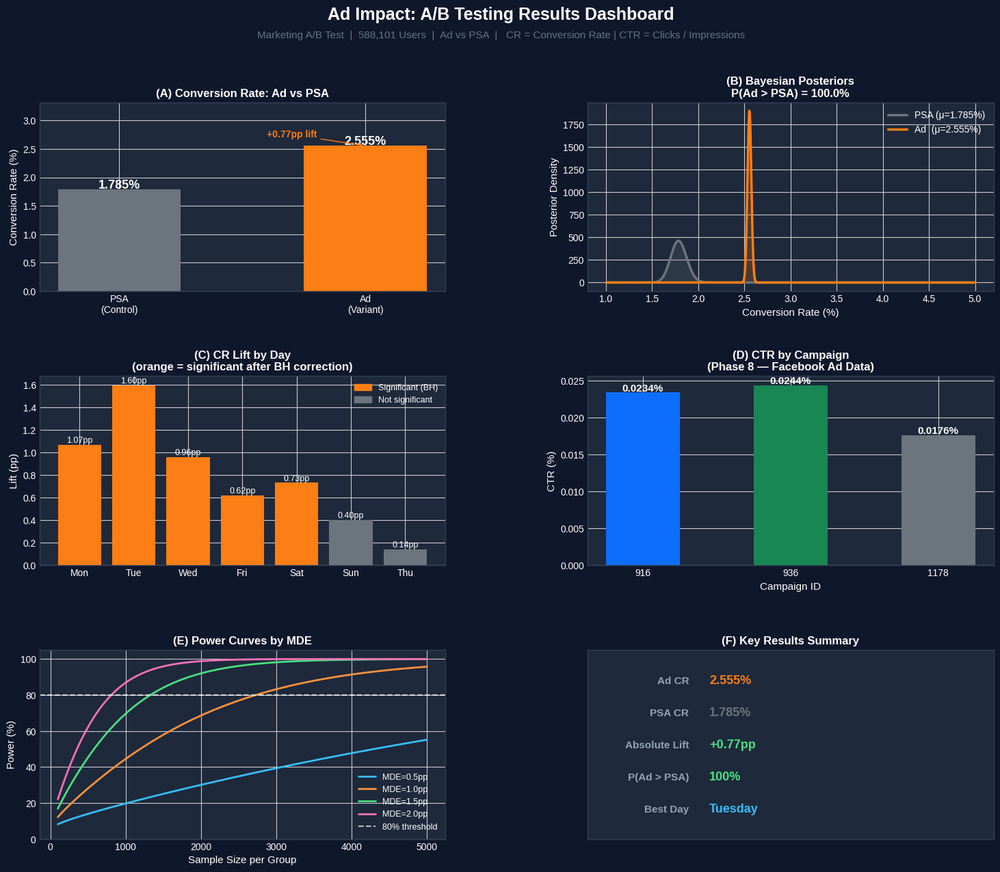

📊 AdImpact: Statistical A/B Testing on Marketing Conversion

A Marketing Campaign project on real data, from hypothesis to business decision.

What This Project Is;

Most **A/B testing** stop at "run a z-test and check if p < 0.05."
This project doesn't. It walks through the full lifecycle of a real
marketing experiment, the kind of rigorous, defensible analysis that
actually informs a go/no-go decision at a company, not just a notebook.

Two real datasets. One randomised experiment. One observational extension.
Frequentist and Bayesian frameworks run side by side. Segment analysis
with proper multiple-testing correction. Power analysis. And a final
recommendation a non-technical stakeholder can act on immediately.

**The Data:**

Primary — Marketing A/B Testing
kaggle datasets download -d faviovaz/marketing-ab-testing

588,101 real users randomly assigned to see either an ad or a neutral
Public Service Announcement (PSA). Binary outcome: did they convert?
This is a genuine randomised controlled experiment — causal conclusions
are valid here.

Extension — Clicks Conversion Tracking
kaggle datasets download -d loveall/clicks-conversion-tracking

1,143 records from three real Facebook ad campaigns. Contains actual
Impressions and Clicks columns — this is where literal
CTR = Clicks ÷ Impressions is computed. Observational data —
associations only, no causal claims.

**Project Structure:**
1. Setup & Data Sourcing
2.  Business framing, hypotheses & OEC definition, 
3. Data quality checks — missing values, duplicates, SRM test 
4. Frequentist hypothesis testing — z-test, effect size & CI
5. Bayesian A/B testing — Beta-Binomial model, P(ad > PSA)
6. Segment analysis — day & hour level, BH correction
7. Power analysis — required N, achieved power, MDE
8. CTR extension — Facebook campaign data, chi-square
9. Results dashboard & Business Translation
10. Q&A — 12 questions covering the full project

**Key Results**

Metric Value - Ad Conversion Rate 2.555% & PSA Conversion Rate 1.785%, Absolute Lift +0.77pp, Relative Lift + 43.1% 
Z-statistic 7.37 p-value<0.000001 P(Ad > PSA) — Bayesian 100%, 95% CI [0.59pp, 0.94pp] Achieved. Power 100% Best performing day Tuesday (+1.60pp lift) Best performing hours: 11 am, 1pm, 2pm, 8pm.

**Recommendation**

Ship the ad. Prioritise Tuesday - Wednesday, 11am - 2pm.

---
Both frequentist and Bayesian frameworks not because one is better,
but because they answer different questions. The frequentist test tells
you whether to reject H₀. The Bayesian model tells you the direct
probability the ad is genuinely better — the number a stakeholder can
actually act on.

Multiple-testing correction — 31 segment tests were run (7 days +
24 hours). Without correction, the familywise false positive rate inflates
to ~79%. Benjamini-Hochberg FDR correction was applied: 12 hour-level
results appeared significant before correction, only 4 survived. Those 8
dropped results would have been acted on incorrectly without this step.

Observational vs experimental distinction — the Facebook extension
dataset is explicitly treated as observational. The language used
throughout is "associated with," not "caused by." This distinction matters
and is flagged at every relevant point.

**Tech Stack**

Python 3.11, Pandas, NumPy, Data wrangling, SciPyZ-test, chi-square, Bayesian sampling, Statsmodels, Proportions, z-test, power analysis, BH correction, Matplotlib, Seaborn, Visualisation, Google Colab, Development environment, Kaggle API, Seaborn Visualisation, Google Colab Development environment, Kaggle API, Seaborn Visualisation

**How to Run the code file**

Open AdImpact_AB_Testing.ipynb in Google Colab (or any IDE)
Connect Kaggle API token to Colab Secrets as KAGGLE_API_TOKEN
(Kaggle → Settings → API → Create New Token)
Run all cells in order — datasets download automatically via the
API, no manual file uploads needed.

**References & Further Reading**

This project was built alongside the following resources, each one
shaped a specific analytical decision in the notebook:

**Books**

Kohavi, R., Tang, D., & Xu, Y. (2020). Trustworthy Online Controlled
Experiments: A Practical Guide to A/B Testing. Cambridge University
Press. - The field's definitive reference. Chapter 21 covers SRM;
Chapter 17 covers the OEC. 

Bruce, P., Bruce, A., & Gedeck, P. (2020). Practical Statistics for
Data Scientists. O'Reilly. - Applied coverage of hypothesis testing
and resampling methods.

Siroker, D., & Koomen, P. (2013). A/B Testing: The Most Powerful Way
to Turn Clicks Into Customers. Wiley. — Business-framed perspective
on experimentation; useful for translating statistical results into
go/no-go language.

**Academic**

Abdey, J. (2009). To p, or not to p? Towards a Balanced Approach to
p-values. PhD thesis, London School of Economics. - Chapter 5 directly
informed the multiple-testing correction methodology and the precise
p-value interpretation used throughout this project.

---
*Built as part of a data science portfolio — 
grounded in real data, real methodology, and real business decisions.*
---

## Connect:
If you found this project useful or want to discuss the methodology, feel free to reach out.

OLAMIDE AKANNI | Data Scientist

---

Feedback welcome!
